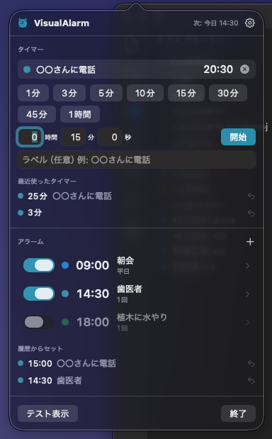

# VisualAlarm

[English](README.md) · [日本語](README.ja.md) · [简体中文](README.zh-Hans.md) · [繁體中文](README.zh-Hant.md) · [한국어](README.ko.md)

**絶対に見逃さないアラーム。**

音も通知も使わず、**画面の見た目だけ**で知らせる macOS のメニューバー常駐アラーム／タイマー。

- 設定時刻の 5 秒前から、画面いっぱいの風船文字「5・4・3・2・1」が中央に吸い込まれたり、破裂したり、落ちたりするカウントダウン
- 設定時刻になると全ディスプレイに、セットしたラベル（「〇〇さんに電話」など）を大きく表示。背景は緑・青系の落ち着いた色
- 表示中も **キーボード入力を一切奪わない**。文字入力中・IME 変換中でも作業は壊れない
- 止める・解除するのはマウスクリックだけ（カウントダウン中は「停止」ボタン、本番表示中は画面のどこでも）
- 時刻指定のアラームと、長さ指定のタイマー（プリセット＋自由入力）。過去の設定は履歴からワンクリックで再セット

こんな人向け:

- 音を出せない場所で作業していて、通知バナーは見逃してしまう
- アラームが鳴ったとき「何のためにセットしたんだっけ」となりがち
- 入力中に割り込まれて、変換中の文字が確定したり作業が止まったりするのが嫌

<p align="center">
  
</p>
<p align="center">
  
</p>

## ダウンロード

Mac App Store からが一番かんたんです。アップデートも自動で届きます。

<a href="https://apps.apple.com/app/id6812729868"></a>

直接ダウンロードもできます: [**VisualAlarm.zip**](https://github.com/yamachan03/VisualAlarm/releases/latest/download/VisualAlarm.zip) — 同じビルドで、Apple の公証済み。解凍して `アプリケーション` に入れるだけで動きます。

## 使い方

1. メニューバーの目覚まし時計アイコンをクリック
2. **タイマー**: プリセットのボタンを押すと即開始。自由入力（時・分・秒＋ラベル）で開始した長さはプリセットに残る（iPhone のタイマーと同じ）
3. **アラーム**: 「＋」で時刻・ラベル・色を設定して保存。「詳細」で曜日の繰り返しも可
4. 設定時刻の 5 秒前からカウントダウンが始まり、時刻になると全画面表示に切り替わる
5. 「履歴からセット」「最近使ったタイマー」から同じ設定を再利用できる（右クリックで履歴から削除）
6. 「テスト表示」でカウントダウンから本番表示までを一通り確認できる

設定（歯車）で言語（既定はシステムに従う。日本語の Mac なら日本語、それ以外は英語。手動で切り替えも可）、カウントダウンの秒数（3〜10 秒）、背景の濃さ、スヌーズの長さ、自動解除、ログイン時の起動などを変えられます。

## 動作環境

- macOS 14 以降
- 権限は不要（ファイル・ネットワーク・通知にアクセスしません）
- 日本語・英語・中国語（簡体字・繁体字）・韓国語の UI（システムの言語に従う。設定で切り替え可）

## 仕組み

オーバーレイはアプリを前面化せず、キーウィンドウにもならないパネル（`NSPanel` の `nonactivatingPanel`）です。
表示中もキーボード入力は直前まで使っていたアプリに届き続けるので、IME の変換状態も壊れません。
カウントダウン中は本体パネルがクリックを下に通し、「停止」ボタンだけが別の小さなパネルでクリックを受けます。

仕様の詳細は [設計書.md](設計書.md)、実装上の決定は [CLAUDE.md](CLAUDE.md) にあります。

## ビルド

```sh
brew install xcodegen   # 未導入なら
xcodegen generate       # project.yml から .xcodeproj を生成（ファイル構成を変えたときだけ）
xcodebuild -project VisualAlarm.xcodeproj -scheme VisualAlarm -configuration Debug build
```

外部ライブラリなし。Xcode で `VisualAlarm.xcodeproj` を開いて ⌘R でも動きます。
公証済みの配布用 zip は `scripts/notarize.sh` で作ります。

## 構成

- [VisualAlarm/App/](VisualAlarm/App/) — エントリポイント、メニューバーのアイコンとパネル
- [VisualAlarm/Models/](VisualAlarm/Models/) — アラーム・タイマー・履歴・設定
- [VisualAlarm/Logic/AlarmStore.swift](VisualAlarm/Logic/AlarmStore.swift) — 保持・永続化・発火判定
- [VisualAlarm/Logic/OverlayController.swift](VisualAlarm/Logic/OverlayController.swift) — 全画面パネルの表示とクリックの受け方
- [VisualAlarm/Views/](VisualAlarm/Views/) — カウントダウン（風船文字）、本番表示、メニューバーのパネル、編集、設定

## ライセンス

[MIT License](LICENSE)
