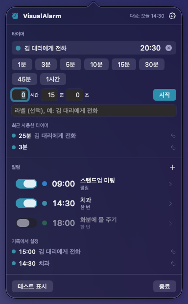

# VisualAlarm

[English](README.md) · [日本語](README.ja.md) · [简体中文](README.zh-Hans.md) · [繁體中文](README.zh-Hant.md) · [한국어](README.ko.md)

소리도 알림 배너도 없이 **화면만으로** 알려주는 macOS 메뉴 막대 알람·타이머입니다.

- 설정 시간 5초 전부터 풍선 모양의 숫자 **5 · 4 · 3 · 2 · 1** 이 화면을 가득 채우며 중앙으로 빨려 들어가거나, 터지거나, 바람이 빠지거나, 떨어집니다
- 시간이 되면 모든 디스플레이에 입력해 둔 라벨(예: "김 대리에게 전화")을 차분한 초록·파랑 배경 위에 큼직하게 표시합니다
- 오버레이는 **키보드 포커스를 절대 가져가지 않습니다**. 글을 쓰는 중이거나 한글 입력기로 조합 중이어도 끊기거나 확정되지 않습니다
- 멈추거나 해제하는 것은 마우스로만: 카운트다운 중에는 '정지' 버튼, 전체 화면 표시 중에는 화면 아무 곳이나 클릭
- 알람(시각 지정)과 타이머(길이 지정, 프리셋 + 직접 입력). 이전 설정은 기록에서 한 번의 클릭으로 다시 설정

<p align="center">
  
</p>
<p align="center">
  
</p>
<p align="center">
  
</p>

이런 분께:

- 소리를 낼 수 없는 곳에서 일하는데 알림 배너를 자꾸 놓치는 분
- 알람이 울리면 "이거 뭐 하려고 맞춰 놨더라?" 하게 되는 분
- 타이핑 중에 방해받아 조합 중이던 글자가 멋대로 확정되는 게 싫은 분

## 다운로드

[**VisualAlarm.zip 다운로드**](https://github.com/yamachan03/VisualAlarm/releases/latest/download/VisualAlarm.zip) — Apple 서명 및 공증 완료. 압축을 풀고 '응용 프로그램'에 넣으면 바로 실행됩니다.

## 사용 방법

1. 메뉴 막대의 알람 시계 아이콘을 클릭
2. **타이머**: 프리셋 버튼을 누르면 바로 시작. 직접 입력한 길이(시 / 분 / 초, 라벨 선택)는 iPhone 타이머처럼 프리셋에 추가됩니다
3. **알람**: **+** 를 눌러 시각·라벨·색상을 설정하고 저장. '세부 설정'을 열면 요일 반복도 가능
4. 설정 시간 5초 전부터 카운트다운이 시작되고, 시간이 되면 전체 화면 표시로 전환됩니다
5. '기록에서 설정', '최근 사용한 타이머'에서 한 번의 클릭으로 재사용 (오른쪽 클릭으로 기록에서 삭제)
6. '테스트 표시'로 카운트다운 → 전체 화면 표시를 한 번 확인할 수 있습니다

설정(톱니바퀴): 언어(기본은 시스템 설정 따르기, 직접 선택 가능), 카운트다운 초(3–10초), 카운트다운 배경 어둡기, 다시 알림 길이, 자동 해제, 로그인 시 실행 등.

## 요구 사항

- macOS 14 이상
- 권한 불필요 (파일·네트워크·알림에 접근하지 않음)
- UI는 한국어·영어·일본어·중국어(간체·번체) 지원

## 동작 원리

오버레이는 `.nonactivatingPanel` 로 만든 `NSPanel` 이며 절대 key window 가 되지 않습니다. 따라서 앱이 활성화되지 않고 키보드 이벤트는 직전까지 쓰던 앱으로 계속 전달되어 입력기의 조합 상태가 그대로 유지됩니다. 카운트다운 중에는 메인 패널이 클릭을 아래 앱으로 통과시키고, '정지' 버튼을 담은 작은 패널만 클릭을 받습니다. 전체 화면 표시에서는 메인 패널이 클릭을 받아 아무 곳이나 클릭하면 해제됩니다.

풍선 숫자는 글리프 윤곽선(CoreText → `Path`)으로 그리기 때문에 진짜 두꺼운 테두리, 그라데이션 채우기, 광택 하이라이트를 넣을 수 있습니다. 등장·퇴장 동작은 경과 시간으로 계산하고 가중치 랜덤으로 고르므로 카운트다운이 매번 다르게 보입니다.

동작 사양은 일본어 [設計書.md](設計書.md) 가 기준이며, 구현 메모는 [CLAUDE.md](CLAUDE.md) 에 있습니다.

## 빌드

```sh
brew install xcodegen   # 없다면
xcodegen generate       # project.yml 에서 .xcodeproj 생성 (파일 구성을 바꿨을 때만)
xcodebuild -project VisualAlarm.xcodeproj -scheme VisualAlarm -configuration Debug build
```

외부 의존성 없음. Xcode 로 `VisualAlarm.xcodeproj` 를 열고 ⌘R 을 눌러도 됩니다. 배포용 서명·공증 zip 은 `scripts/notarize.sh` 로 만듭니다.

## 라이선스

[MIT License](LICENSE)
