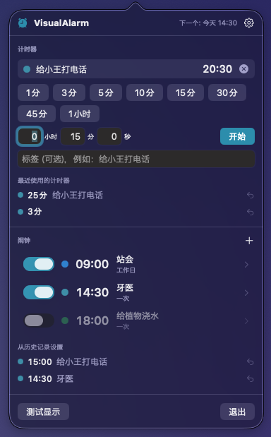

# VisualAlarm

[English](README.md) · [日本語](README.ja.md) · [简体中文](README.zh-Hans.md) · [繁體中文](README.zh-Hant.md) · [한국어](README.ko.md)

**绝不会错过的闹钟。**

一款只靠**屏幕**提醒你的 macOS 菜单栏闹钟与计时器——没有声音，也没有通知横幅。

- 设定时间前 5 秒，气球风格的数字 **5 · 4 · 3 · 2 · 1** 铺满屏幕，被吸入中央、爆开、泄气或坠落
- 到点时，所有显示器都会在柔和的绿色/蓝色背景上以大字显示你输入的标签（例如"给小王打电话"）
- 提示层**绝不抢走键盘焦点**。哪怕你正在输入、正在用输入法选字，也不会被打断或误确认
- 只用鼠标来停止或关闭：倒计时中点击"停止"按钮，全屏提醒时点击屏幕任意位置
- 闹钟（按时间）与计时器（按时长，预设 + 自由输入）。用过的设置在历史记录里一键重设

<p align="center">
  
</p>
<p align="center">
  
</p>
<p align="center">
  
</p>

适合你，如果：

- 你在不能出声的地方工作，而通知横幅总是被你错过
- 闹钟响起时你常常想"这是为了什么来着？"
- 你讨厌打字时被打断、还没选完的字被强行确认

## 下载

[**下载 VisualAlarm.zip**](https://github.com/yamachan03/VisualAlarm/releases/latest/download/VisualAlarm.zip) — 已由 Apple 签名并公证。解压后拖入"应用程序"即可运行。

## 使用方法

1. 点击菜单栏的闹钟图标
2. **计时器**：点击预设按钮立即开始。手动输入的时长（时 / 分 / 秒，可加标签）会像 iPhone 计时器一样加入预设
3. **闹钟**：点击 **+**，设置时间、标签和颜色后保存。展开"详细"可设置按星期重复
4. 设定时间前 5 秒开始倒计时，到点后切换为全屏提醒
5. 在"从历史记录设置""最近使用的计时器"中一键复用（右键可从历史记录中删除）
6. "测试显示"会完整演示一次倒计时 → 全屏提醒

设置（齿轮图标）：语言（默认跟随系统，可手动选择）、倒计时秒数（3–10 秒）、倒计时背景深度、稍后提醒时长、自动关闭、登录时启动等。

## 系统要求

- macOS 14 或更高版本
- 不需要任何权限（不访问文件、网络或通知）
- 界面支持简体中文、繁体中文、英文、日文、韩文

## 工作原理

提示层是以 `.nonactivatingPanel` 创建的 `NSPanel`，永远不会成为 key window，因此 App 不会被激活，键盘事件继续流向你正在使用的应用——输入法的组合状态原封不动。倒计时期间主面板把点击透传给下方的应用，只有承载"停止"按钮的小面板接受点击；全屏提醒时主面板接受点击，因此点击任意位置即可关闭。

气球数字由字形轮廓（CoreText → `Path`）绘制，因此能有真正的粗描边、渐变填充和高光。入场与退场动画根据经过时间计算，并按权重随机选择，所以每次倒计时都不一样。

行为规范以日文的 [設計書.md](設計書.md) 为准；实现说明见 [CLAUDE.md](CLAUDE.md)。

## 构建

```sh
brew install xcodegen   # 若尚未安装
xcodegen generate       # 从 project.yml 生成 .xcodeproj（仅在改动文件结构后需要）
xcodebuild -project VisualAlarm.xcodeproj -scheme VisualAlarm -configuration Debug build
```

无第三方依赖。也可以用 Xcode 打开 `VisualAlarm.xcodeproj` 后按 ⌘R 运行。`scripts/notarize.sh` 用于生成发布用的签名与公证 zip。

## 许可证

[MIT License](LICENSE)
