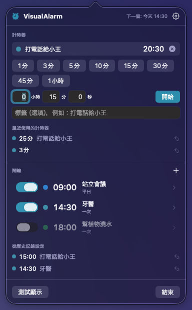

# VisualAlarm

[English](README.md) · [日本語](README.ja.md) · [简体中文](README.zh-Hans.md) · [繁體中文](README.zh-Hant.md) · [한국어](README.ko.md)

**絕不會錯過的鬧鐘。**

一款只靠**螢幕**提醒你的 macOS 選單列鬧鐘與計時器——沒有聲音，也沒有通知橫幅。

- 設定時間前 5 秒，氣球風格的數字 **5 · 4 · 3 · 2 · 1** 鋪滿螢幕，被吸入中央、爆開、洩氣或墜落
- 時間一到，所有顯示器都會在柔和的綠色/藍色背景上以大字顯示你輸入的標籤（例如「打電話給小王」）
- 提示層**絕不搶走鍵盤焦點**。就算你正在輸入、正在用輸入法選字，也不會被打斷或誤確認
- 只用滑鼠來停止或關閉：倒數中按「停止」按鈕，全螢幕提醒時點一下螢幕任意位置
- 鬧鐘（依時間）與計時器（依長度，預設 + 自由輸入）。用過的設定在歷史記錄裡一鍵重設

<p align="center">
  
</p>
<p align="center">
  
</p>
<p align="center">
  
</p>

適合你，如果：

- 你在不能出聲的地方工作，而通知橫幅總是被你錯過
- 鬧鐘響起時你常常想「這是為了什麼來著？」
- 你討厭打字時被打斷、還沒選完的字被強行確認

## 下載

最簡單的方式是從 Mac App Store 安裝，更新也會自動送達。

<a href="https://apps.apple.com/app/id6812729868"></a>

也可以直接下載：[**VisualAlarm.zip**](https://github.com/yamachan03/VisualAlarm/releases/latest/download/VisualAlarm.zip) — 與商店版本相同，已由 Apple 簽署並公證。解壓縮後拖入「應用程式」即可執行。

## 使用方法

1. 點一下選單列的鬧鐘圖示
2. **計時器**：按預設按鈕立即開始。手動輸入的長度（時 / 分 / 秒，可加標籤）會像 iPhone 計時器一樣加入預設
3. **鬧鐘**：按 **+**，設定時間、標籤與顏色後儲存。展開「詳細」可設定依星期重複
4. 設定時間前 5 秒開始倒數，時間到後切換為全螢幕提醒
5. 在「從歷史記錄設定」「最近使用的計時器」中一鍵重複使用（右鍵可從歷史記錄移除）
6. 「測試顯示」會完整示範一次倒數 → 全螢幕提醒

設定（齒輪圖示）：語言（預設跟隨系統，可手動選擇）、倒數秒數（3–10 秒）、倒數背景深度、稍後提醒長度、自動關閉、登入時啟動等。

## 系統需求

- macOS 14 或更新版本
- 不需要任何權限（不存取檔案、網路或通知）
- 介面支援繁體中文、簡體中文、英文、日文、韓文

## 運作原理

提示層是以 `.nonactivatingPanel` 建立的 `NSPanel`，永遠不會成為 key window，因此 App 不會被啟用，鍵盤事件繼續流向你正在使用的應用程式——輸入法的組字狀態原封不動。倒數期間主面板把點擊透傳給下方的應用程式，只有承載「停止」按鈕的小面板接受點擊；全螢幕提醒時主面板接受點擊，因此點一下任意位置即可關閉。

氣球數字由字形輪廓（CoreText → `Path`）繪製，因此能有真正的粗描邊、漸層填色與高光。進場與退場動畫依經過時間計算，並按權重隨機選擇，所以每次倒數都不一樣。

行為規範以日文的 [設計書.md](設計書.md) 為準；實作說明見 [CLAUDE.md](CLAUDE.md)。

## 建置

```sh
brew install xcodegen   # 若尚未安裝
xcodegen generate       # 從 project.yml 產生 .xcodeproj（僅在更動檔案結構後需要）
xcodebuild -project VisualAlarm.xcodeproj -scheme VisualAlarm -configuration Debug build
```

無第三方相依套件。也可以用 Xcode 開啟 `VisualAlarm.xcodeproj` 後按 ⌘R 執行。`scripts/notarize.sh` 用於產生發布用的簽署與公證 zip。

## 授權

[MIT License](LICENSE)
